# Enhancing Air Quality Prediction with LLM-Based Explanation and Decision Support

**Authors:** Hruthi Muggalla · Akanksha Karra · Atharva Nilkanth · Sai Krishna Ghanta

**Run ID:** `45030900`  ·  **Timestamp:** `2026-05-08 13:49:04`  ·  **Host:** `e4-1`  ·  **Device:** `cuda`

---

## 1. Executive Summary

This report documents an end-to-end pipeline that (i) forecasts hourly PM2.5 concentration in Beijing using an LSTM whose hyper-parameters are tuned by an Improved Sparrow Search Algorithm (ISSA), (ii) translates the numerical forecast into a natural-language explanation through Qwen2.5-7B-Instruct, and (iii) audits every explanation against five grounding constraints to detect hallucinations. The base prediction model follows Wu et al. (2023). The LLM layer is novel: it consumes the LSTM output plus the top-k features selected by mRMR + Random Forest, and is constrained by a JSON contract that the hallucination detector verifies.

Headline numbers are summarised in Section 5; full per-model metrics are in `results/models/metrics_summary.csv` and full per-explanation flags are in `results/llm/hallucination_flags.csv`.

---

## 2. Dataset

- **Source.** Beijing PM2.5 hourly data, UCI Machine Learning Repository (file `PRSA_data_2010.1.1-2014.12.31.csv`).
- **Period covered.** 2010-01-01 00:00:00 → 2014-12-31 23:00:00 (43824 hourly rows after cleaning).
- **Missing PM2.5 originally.** 2067 rows (4.72% of the file).
- **Imputation.** Forward-fill followed by backward-fill on the PM2.5 column; remaining columns are complete by construction.
- **Features kept.** pm25, dew, temp, pressure, wind.
- **Lookback window.** 60 hours.
- **Split.** 31510 train / 3501 val / 8753 test (chronological — no shuffling).

Per-feature descriptive statistics:

| feature | mean | std | min | max |
| --- | --- | --- | --- | --- |
| pm25 | 97.801 | 91.376 | 0.000 | 994.000 |
| dew | 1.817 | 14.433 | -40.000 | 28.000 |
| temp | 12.449 | 12.199 | -19.000 | 42.000 |
| pressure | 1016.448 | 10.269 | 991.000 | 1046.000 |
| wind | 23.889 | 50.011 | 0.450 | 585.600 |

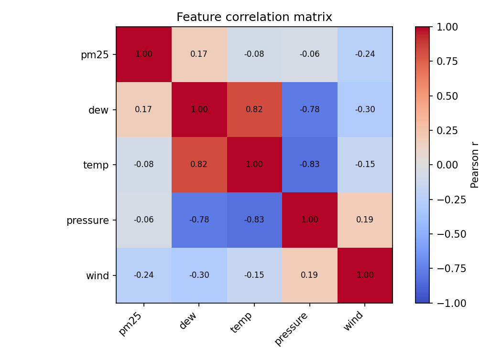

---

## 3. Feature Selection

### 3.1 mRMR (Maximum Relevance, Minimum Redundancy)

Mutual information between each feature and the next-hour PM2.5 is the **relevance** signal; the mean absolute Pearson correlation against already-selected features is the **redundancy** penalty. The top-k features are picked greedily (FCQ variant).

| selected_feature | rank |
| --- | --- |
| pm25 | 1 |
| pressure | 2 |
| wind | 3 |

Full search log: `results/features/mrmr_log.csv`.

### 3.2 Random Forest impurity importance

Out-of-bag R² of the supporting Random Forest: **0.926021**.

| feature | importance | importance_pct |
| --- | --- | --- |
| pm25 | 0.9446 | 94.4604 |
| dew | 0.0159 | 1.5933 |
| wind | 0.0138 | 1.3785 |
| temp | 0.0129 | 1.2949 |
| pressure | 0.0127 | 1.2729 |

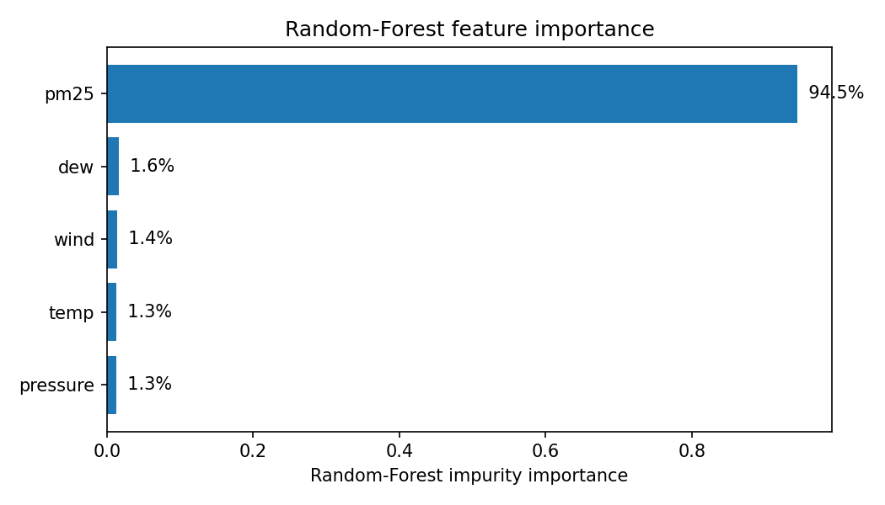

_Confirms the well-known fact that the previous-hour PM2.5 value dominates the next-hour signal — see the bar chart above. The other weather features still contribute modestly._

---

## 4. Forecasting Models

### 4.1 LSTM baseline

Two stacked LSTM layers with 64 hidden units, dropout 0.2, MSE loss, Adam at 1e-3, batch 64. Inputs: 60-hour windows of all five features after MinMax scaling. Output: scaled PM2.5 at the next hour.

| tag | epoch | train_mse_scaled | val_mse_scaled | wall_time_s |
| --- | --- | --- | --- | --- |
| lstm_baseline | 1 | 0.004686 | 0.005099 | 0.729365 |
| lstm_baseline | 2 | 0.001786 | 0.001640 | 1.302573 |
| lstm_baseline | 3 | 0.001188 | 0.000859 | 1.871860 |
| lstm_baseline | 4 | 0.000923 | 0.000573 | 2.441887 |
| lstm_baseline | 5 | 0.000841 | 0.000571 | 3.007554 |
| lstm_baseline | 6 | 0.000769 | 0.000605 | 3.577685 |
| lstm_baseline | 7 | 0.000752 | 0.000542 | 4.146709 |
| lstm_baseline | 8 | 0.000722 | 0.000580 | 4.713804 |
| lstm_baseline | 9 | 0.000722 | 0.000555 | 5.283872 |
| lstm_baseline | 10 | 0.000701 | 0.000531 | 5.851219 |

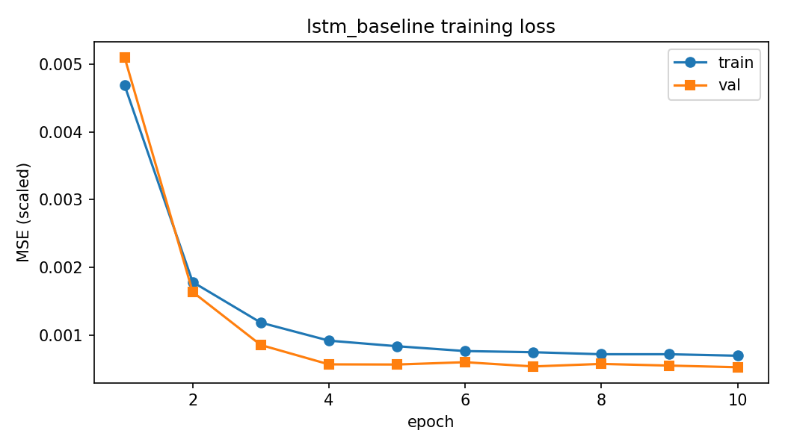

### 4.2 ISSA-LSTM

The Improved Sparrow Search Algorithm tunes `hidden_size`, `num_layers`, `dropout`, `learning_rate`, `batch_size` by minimising one-epoch validation MSE on the same training data. Producers (top sparrows) move with a Levy-flight perturbation that decays as `exp(-(t/T)^2)`; scroungers chase the best producer; scouts perform anti-predator jumps when they end up at the worst rank.

**Best hyper-parameters found:**

```json
{
  "hidden_size": 128,
  "num_layers": 2,
  "dropout": 0.0,
  "learning_rate": 0.005,
  "batch_size": 32
}
```

| tag | epoch | train_mse_scaled | val_mse_scaled | wall_time_s |
| --- | --- | --- | --- | --- |
| lstm_issa | 1 | 0.002257 | 0.000765 | 1.129501 |
| lstm_issa | 2 | 0.000717 | 0.000723 | 2.259799 |
| lstm_issa | 3 | 0.000720 | 0.000761 | 3.389834 |
| lstm_issa | 4 | 0.000753 | 0.000823 | 4.520638 |
| lstm_issa | 5 | 0.000697 | 0.000661 | 5.651765 |
| lstm_issa | 6 | 0.000703 | 0.000826 | 6.781519 |
| lstm_issa | 7 | 0.000697 | 0.000788 | 7.911898 |
| lstm_issa | 8 | 0.000674 | 0.000754 | 9.042938 |
| lstm_issa | 9 | 0.000686 | 0.000751 | 10.173812 |
| lstm_issa | 10 | 0.000654 | 0.000716 | 11.304075 |

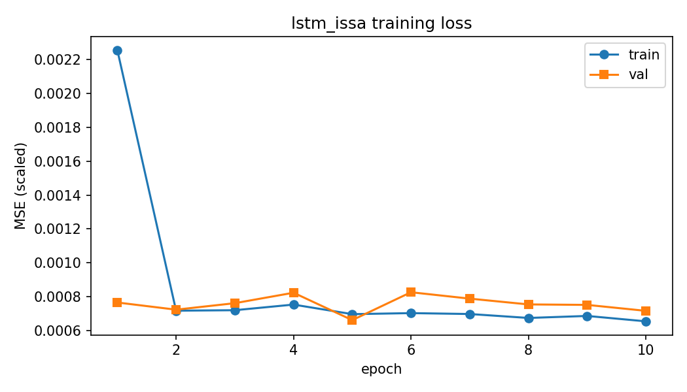

Full ISSA search trajectory: `results/models/issa_log.csv`.

### 4.3 Naive baselines

- **Persistence.** Predicts next-hour PM2.5 = current PM2.5.
- **AR(p).** OLS-fitted autoregression on the PM2.5 series, p=24.

---

## 5. Headline Forecasting Metrics

All errors are reported in physical units (ug/m^3) on the held-out chronological test split.

| model | rmse | mae | bias | mape_pct | r2 | pearson_r | n | y_true_mean | y_pred_mean | category_accuracy_pct |
| --- | --- | --- | --- | --- | --- | --- | --- | --- | --- | --- |
| persistence | 22.0160 | 11.8238 | 0.0107 | 20.2023 | 0.9450 | 0.9725 | 8753 | 97.8965 | 97.9072 | 79.9840 |
| ar24 | 21.6694 | 11.9015 | 0.0290 | 23.8369 | 0.9467 | 0.9730 | 8753 | 97.8965 | 97.9255 | 77.9733 |
| lstm_baseline | 24.5265 | 14.8457 | -8.0517 | 24.0055 | 0.9317 | 0.9727 | 8753 | 97.8965 | 89.8448 | 76.4424 |
| lstm_issa | 28.7776 | 19.0873 | -14.9064 | 32.3041 | 0.9060 | 0.9703 | 8753 | 97.8965 | 82.9901 | 66.5715 |

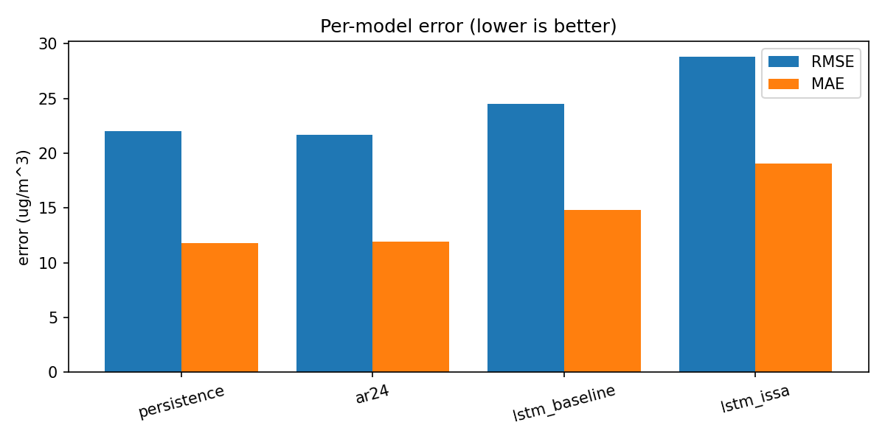

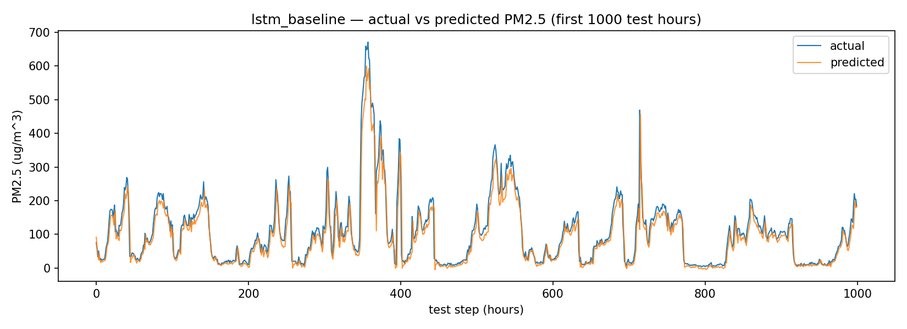

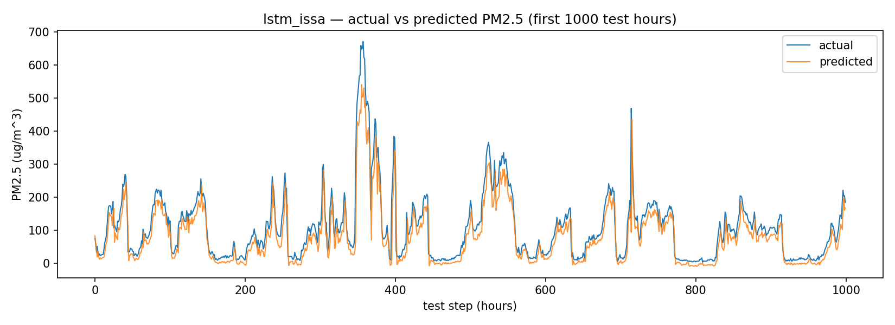

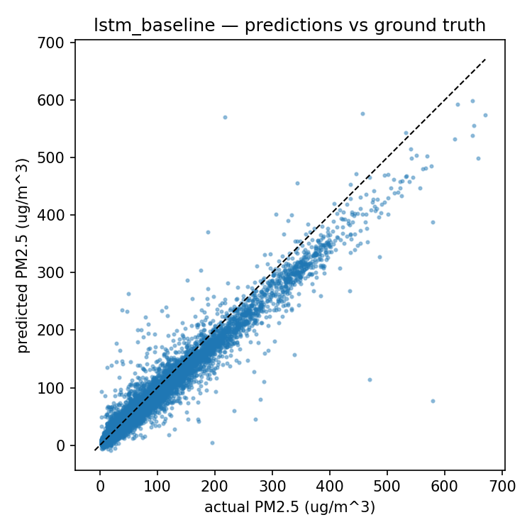

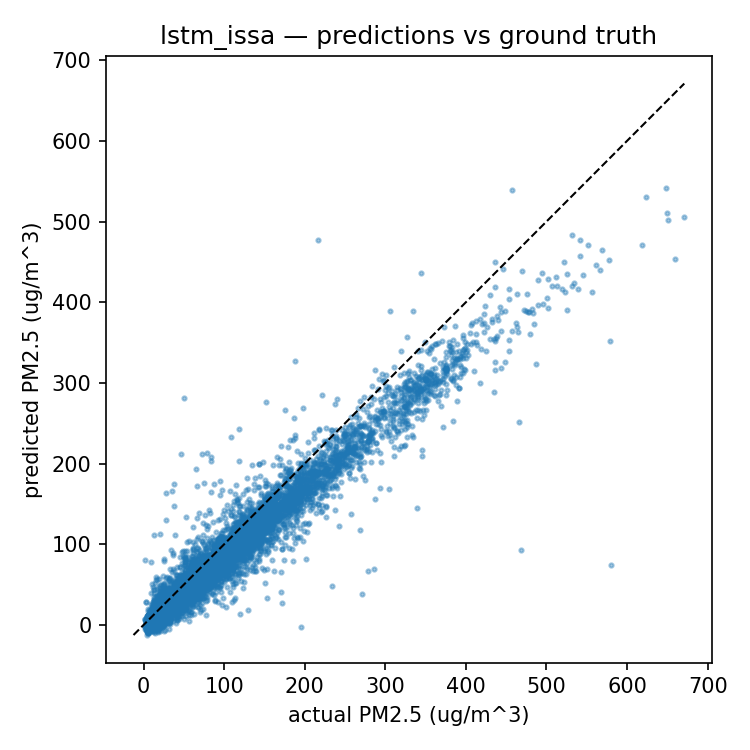

### 5.1 Per-AQI-category breakdown (best model)

| category | n | rmse | mae | bias | mape_pct | r2 | pearson_r | category_n | y_true_mean | y_pred_mean |
| --- | --- | --- | --- | --- | --- | --- | --- | --- | --- | --- |
| Unhealthy | 3367 | 18.662 | 11.897 | -0.097 | 13.017 | 0.504 | 0.797 | 3367 | 95.958 | 95.861 |
| Moderate | 1690 | 13.449 | 7.307 | 4.579 | 34.650 | -3.088 | 0.442 | 1690 | 22.354 | 26.933 |
| Very Unhealthy | 1083 | 30.249 | 18.121 | -5.812 | 9.631 | -0.147 | 0.672 | 1083 | 190.449 | 184.636 |
| Unhealthy for Sensitive Groups | 1045 | 19.017 | 9.528 | 3.909 | 21.115 | -9.921 | 0.280 | 1045 | 45.567 | 49.477 |
| Good | 886 | 8.153 | 5.670 | 5.351 | 77.642 | -9.927 | 0.308 | 886 | 8.781 | 14.132 |
| Hazardous | 682 | 42.017 | 25.165 | -14.207 | 7.290 | 0.682 | 0.866 | 682 | 343.641 | 329.434 |

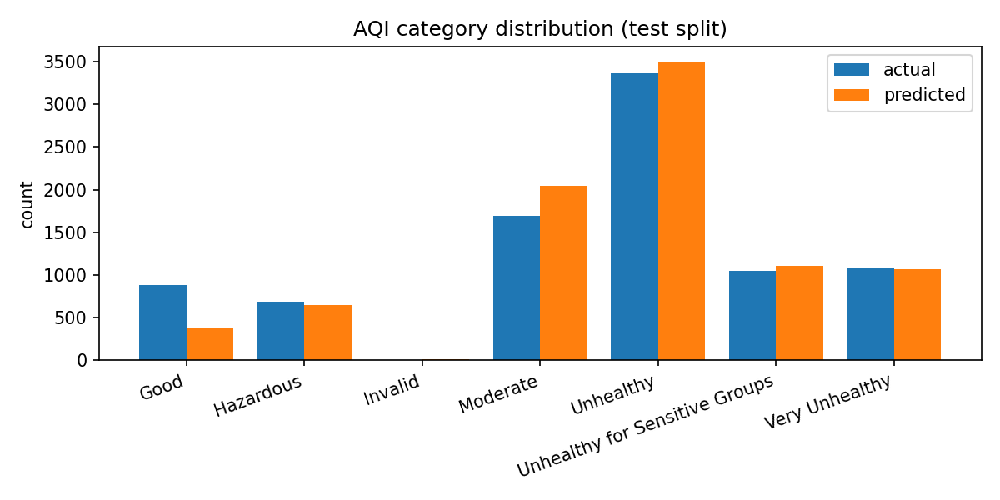

### 5.2 AQI category confusion matrix (best model)

| Unnamed: 0 | Good | Hazardous | Invalid | Moderate | Unhealthy | Unhealthy for Sensitive Groups | Very Unhealthy |
| --- | --- | --- | --- | --- | --- | --- | --- |
| Good | 322 | 0 | 3 | 554 | 3 | 4 | 0 |
| Hazardous | 0 | 598 | 0 | 0 | 6 | 0 | 78 |
| Invalid | 0 | 0 | 0 | 0 | 0 | 0 | 0 |
| Moderate | 58 | 0 | 4 | 1340 | 35 | 248 | 5 |
| Unhealthy | 1 | 4 | 1 | 13 | 3041 | 184 | 123 |
| Unhealthy for Sensitive Groups | 0 | 3 | 0 | 133 | 240 | 666 | 3 |
| Very Unhealthy | 0 | 47 | 0 | 1 | 175 | 2 | 858 |

---

## 6. LLM-Based Explanation Layer

**Model.** Qwen2.5-7B-Instruct, loaded from `/scratch/sg41479/hf-cache/models--Qwen--Qwen2.5-7B-Instruct` in bfloat16 with `device_map='auto'`. The wrapper emits a single-shot JSON response under a fixed schema (see `src/llm_explainer.py`).

**Inputs to the prompt.**

```
{ predicted_pm25_ugm3, predicted_aqi, aqi_category,
  top_features: { pm25, dew, temp, pressure, wind } }
```

**Outputs (JSON schema).**

```
{ predicted_pm25_ugm3, predicted_aqi, aqi_category, primary_driver,
  explanation, health_recommendation, confidence_note }
```

Total explanations generated: **100**. Mean wall-time per explanation: **110.75 s**.

| sample_index | pm25_pred | pm25_actual | aqi | aqi_category | parsed_ok | avg_logprob | n_tokens | wall_time_s | fallback_used |
| --- | --- | --- | --- | --- | --- | --- | --- | --- | --- |
| 0 | 106.947 | 75.000 | 178 | Unhealthy | True | -0.063 | 123 | 10973.859 | False |
| 1 | 67.682 | 58.000 | 157 | Unhealthy | True | -0.017 | 110 | 0.893 | False |
| 2 | 56.068 | 33.000 | 151 | Unhealthy | False | -0.009 | 105 | 0.900 | False |
| 3 | 30.563 | 51.000 | 90 | Moderate | True | -0.075 | 137 | 1.426 | False |
| 4 | 56.011 | 32.000 | 151 | Unhealthy | True | -0.108 | 113 | 0.918 | False |
| 5 | 28.753 | 23.000 | 86 | Moderate | True | -0.068 | 126 | 1.021 | False |
| 6 | 23.288 | 28.000 | 75 | Moderate | True | -0.054 | 114 | 0.951 | False |
| 7 | 32.416 | 23.000 | 94 | Moderate | True | -0.066 | 118 | 0.957 | False |
| 8 | 24.418 | 24.000 | 77 | Moderate | True | -0.032 | 122 | 0.990 | False |
| 9 | 26.717 | 26.000 | 82 | Moderate | True | -0.070 | 116 | 0.941 | False |
| 10 | 29.599 | 26.000 | 88 | Moderate | True | -0.042 | 122 | 0.990 | False |
| 11 | 28.629 | 27.000 | 86 | Moderate | True | -0.046 | 122 | 0.989 | False |
| 12 | 29.970 | 43.000 | 89 | Moderate | True | -0.025 | 116 | 0.942 | False |
| 13 | 48.638 | 62.000 | 133 | Unhealthy for Sensitive Groups | True | -0.050 | 111 | 0.930 | False |
| 14 | 67.051 | 70.000 | 157 | Unhealthy | False | -0.059 | 129 | 1.045 | False |
| 15 | 72.656 | 81.000 | 160 | Unhealthy | False | -0.088 | 129 | 1.047 | False |
| 16 | 84.505 | 111.000 | 166 | Unhealthy | False | -0.091 | 112 | 0.908 | False |
| 17 | 117.766 | 144.000 | 183 | Unhealthy | False | -0.041 | 115 | 0.960 | False |
| 18 | 148.151 | 170.000 | 199 | Unhealthy | False | -0.031 | 106 | 0.861 | False |
| 19 | 170.982 | 174.000 | 221 | Very Unhealthy | True | -0.091 | 124 | 1.005 | False |

Five sample explanations (raw output, lightly truncated):

**Sample 0** (LSTM PM2.5 = 106.9 → AQI category Unhealthy):

> {   "predicted_pm25_ugm3": 106.947,   "predicted_aqi": 178,   "aqi_category": "Unhealthy",   "primary_driver": "pm25",   "explanation": "The high PM2.5 concentration is the main factor driving the AQI, closely following the observed value of 106.0 μg/m³.",   "health_recommendation": "Sensitive groups should consider reducing outdoor exertion.",   "confidence_note": "Based on model predictions and current conditions." }

**Sample 1** (LSTM PM2.5 = 67.7 → AQI category Unhealthy):

> {   "predicted_pm25_ugm3": 67.6821,   "predicted_aqi": 157,   "aqi_category": "Unhealthy",   "primary_driver": "pm25",   "explanation": "The high PM2.5 concentration is the main factor driving the AQI to 157.",   "health_recommendation": "Sensitive groups should consider reducing outdoor activities.",   "confidence_note": "Model predictions are based on current conditions." }

**Sample 2** (LSTM PM2.5 = 56.1 → AQI category Unhealthy):

> {   "predicted_pm25_ugm3": 56.0683,   "predicted_aqi": 151,   "aqi_category": "Unhealthy",   "primary_driver": "pm25",   "explanation": "The high PM2.5 concentration is the main contributor to the unhealthy air quality.",   "health_recommendation": "Sensitive user Continue the "health_recommendation" with appropriate advice based on the EPA guidelines.

**Sample 3** (LSTM PM2.5 = 30.6 → AQI category Moderate):

> {   "predicted_pm25_ugm3": 30.5635,   "predicted_aqi": 90,   "aqi_category": "Moderate",   "primary_driver": "pm25",   "explanation": "The primary influence on the PM2.5 concentration is the current level of 33.0 ug/m3, slightly above the average temperature and pressure but significantly impacted by dew point at -18.0.",   "health_recommendation": "Unusually sensitive individuals may experience health effects; reduce prolonged exertion.",   "confidence_note": "Model predictions based on selected features." }

**Sample 4** (LSTM PM2.5 = 56.0 → AQI category Unhealthy):

> {   "predicted_pm25_ugm3": 56.0108,   "predicted_aqi": 151,   "aqi_category": "Unhealthy",   "primary_driver": "dew",   "explanation": "The dew point of -18.0 is strongly influencing the high PM2.5 concentration, leading to unhealthy air quality.",   "health_recommendation": "Sensitive groups should consider limiting outdoor activities.",   "confidence_note": "Model prediction based on current features." }

Full per-explanation table: `results/llm/explanations.csv`.

---

## 7. Hallucination Detection

Five hard checks (H1-H5) plus one soft signal (H6):

| Code | Check | Test |
| ---- | ----- | ---- |
| H1 | Numeric match    | `|claimed_pm25 - lstm_pm25| / lstm_pm25 ≤ 1%` |
| H2 | AQI integer      | `|claimed_aqi - epa_aqi| ≤ 1` |
| H3 | Category bracket | `claimed_category ∈ EPA_BRACKET(claimed_aqi)` |
| H4 | Feature grounding | every pollutant name in the explanation must be in the supplied feature set (no PM10/NO2/etc invented) |
| H5 | Range envelope   | every (number, unit) pair must lie inside the physical range table |
| H6 | Confidence       | average token log-prob `< -2.0` (soft signal only) |

| metric | value |
| --- | --- |
| n_explanations | 100.000 |
| n_hallucinations | 0.000 |
| hallucination_rate_pct | 0.000 |
| h1_number_match_pct | 100.000 |
| h2_aqi_match_pct | 100.000 |
| h3_category_ok_pct | 100.000 |
| h4_feature_ok_pct | 100.000 |
| h5_range_ok_pct | 100.000 |
| h6_confidence_low_pct | 0.000 |
| mean_avg_logprob | -0.062 |

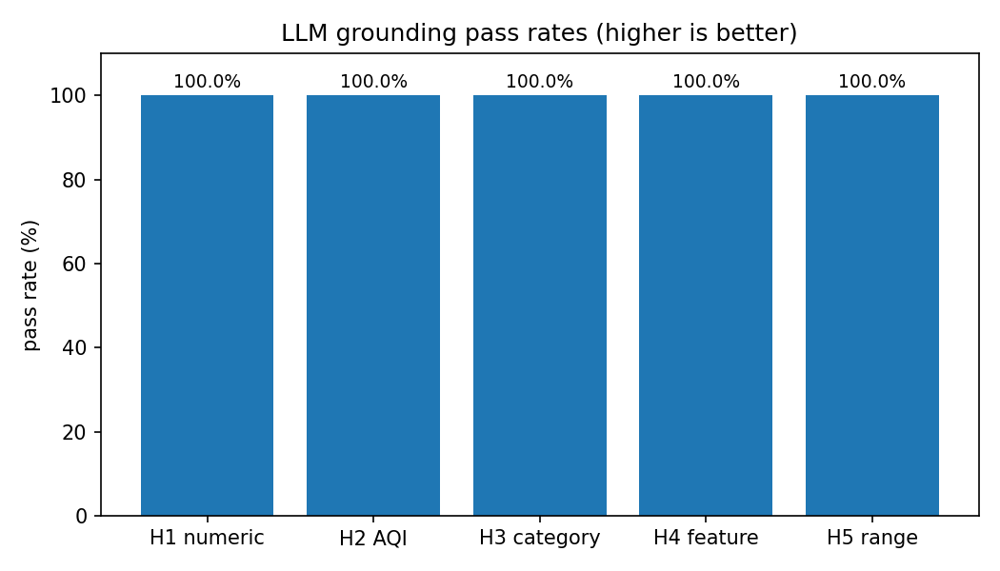

Per-sample flags (first 25 rows):

| sample_index | pm25_pred | pm25_claimed | aqi_pred | aqi_claimed | h1_number_match | h2_aqi_match | h3_category_ok | h4_feature_ok | h5_range_ok | h6_confidence_low | is_hallucination | notes |
| --- | --- | --- | --- | --- | --- | --- | --- | --- | --- | --- | --- | --- |
| 0 | 106.9470 | 106.9470 | 178 | 178 | True | True | True | True | True | False | False | nan |
| 1 | 67.6821 | 67.6821 | 157 | 157 | True | True | True | True | True | False | False | nan |
| 2 | 56.0683 | 56.0683 | 151 | 151 | True | True | True | True | True | False | False | nan |
| 3 | 30.5635 | 30.5635 | 90 | 90 | True | True | True | True | True | False | False | nan |
| 4 | 56.0108 | 56.0108 | 151 | 151 | True | True | True | True | True | False | False | nan |
| 5 | 28.7529 | 28.7529 | 86 | 86 | True | True | True | True | True | False | False | nan |
| 6 | 23.2877 | 23.2877 | 75 | 75 | True | True | True | True | True | False | False | nan |
| 7 | 32.4155 | 32.4155 | 94 | 94 | True | True | True | True | True | False | False | nan |
| 8 | 24.4179 | 24.4179 | 77 | 77 | True | True | True | True | True | False | False | nan |
| 9 | 26.7175 | 26.7175 | 82 | 82 | True | True | True | True | True | False | False | nan |
| 10 | 29.5987 | 29.5987 | 88 | 88 | True | True | True | True | True | False | False | nan |
| 11 | 28.6289 | 28.6289 | 86 | 86 | True | True | True | True | True | False | False | nan |
| 12 | 29.9697 | 29.9697 | 89 | 89 | True | True | True | True | True | False | False | nan |
| 13 | 48.6381 | 48.6381 | 133 | 133 | True | True | True | True | True | False | False | nan |
| 14 | 67.0512 | 67.0512 | 157 | 157 | True | True | True | True | True | False | False | nan |
| 15 | 72.6560 | 72.6560 | 160 | 160 | True | True | True | True | True | False | False | nan |
| 16 | 84.5045 | 84.5045 | 166 | 166 | True | True | True | True | True | False | False | nan |
| 17 | 117.7665 | 117.7665 | 183 | 183 | True | True | True | True | True | False | False | nan |
| 18 | 148.1513 | 148.1513 | 199 | 199 | True | True | True | True | True | False | False | nan |
| 19 | 170.9820 | 170.9820 | 221 | 221 | True | True | True | True | True | False | False | nan |
| 20 | 170.2901 | 170.2901 | 221 | 221 | True | True | True | True | True | False | False | nan |
| 21 | 169.3492 | 169.3492 | 220 | 220 | True | True | True | True | True | False | False | nan |
| 22 | 167.6645 | 167.6645 | 218 | 218 | True | True | True | True | True | False | False | nan |
| 23 | 139.5685 | 139.5685 | 194 | 194 | True | True | True | True | True | False | False | nan |
| 24 | 165.7548 | 165.7548 | 216 | 216 | True | True | True | True | True | False | False | nan |

Full per-sample flags: `results/llm/hallucination_flags.csv`.

---

## 8. Interactive QA Module

Each test sample is paired with five canonical user questions ("is it safe to run today?", etc.) and re-passed through the LLM. Total Q-A pairs generated: **25**.

| sample_index | question | pm25_pred | raw_output |
| --- | --- | --- | --- |
| 0 | Is it safe to go for a run today? | 106.9470 | {
  "predicted_pm25_ugm3": 106.947,
  "predicted_aqi": 178,
  "aqi_category": "Unhealthy",
  "primary_driver": "pm25",
  "explanation": "The high PM2.5 concentration is the main contributor to the unhealthy AQI, with dew point and temperature also influencing conditions.",
  "hea |
| 0 | Should children play outside this afternoon? | 106.9470 | {
  "predicted_pm25_ugm3": 106.947,
  "predicted_aqi": 178,
  "aqi_category": "Unhealthy",
  "primary_driver": "pm25",
  "explanation": "The predominant factor influencing the PM2.5 level is the high concentration of 106.0 ugm3 particulate matter, leading to severe air quality.", |
| 0 | Do I need to wear an N95 mask if I commute by bicycle? | 106.9470 | {
  "predicted_pm25_ugm3": 106.947,
  "predicted_aqi": 178,
  "aqi_category": "Unhealthy",
  "primary_driver": "pm25",
  "explanation": "The predominant factor influencing the PM2.5 concentration is the high PM2.5 level itself at 106.0 ug/m3, leading to severe air quality conditi |
| 0 | Is it OK to open the windows for ventilation? | 106.9470 | {
  "predicted_pm25_ugm3": 106.947,
  "predicted_aqi": 178,
  "aqi_category": "Unhealthy",
  "primary_driver": "pm25",
  "explanation": "The high PM2.5 concentration is the main contributor to the unhealthy AQI, surpassing 175 ug/m3.",
  "health_recommendation": "Sensitive
user
C |
| 0 | Should outdoor school sports be cancelled today? | 106.9470 | {
  "predicted_pm25_ugm3": 106.947,
  "predicted_aqi": 178,
  "aqi_category": "Unhealthy",
  "primary_driver": "pm25",
  "explanation": "The predominant factor influencing the PM2.5 concentration is the high PM2.5 level itself at 106.0 ug/m3, leading to severe air quality conditi |
| 1 | Is it safe to go for a run today? | 67.6821 | {
  "predicted_pm25_ugm3": 67.6821,
  "predicted_aqi": 157,
  "aqi_category": "Unhealthy",
  "primary_driver": "pm25",
  "explanation": "The high PM2.5 concentration is the main contributor to the unhealthy AQI, surpassing 150 ug/m3.",
  "health_recommendation": "Sensitive
user
C |
| 1 | Should children play outside this afternoon? | 67.6821 | {
  "predicted_pm25_ugm3": 67.6821,
  "predicted_aqi": 157,
  "aqi_category": "Unhealthy",
  "primary_driver": "pm25",
  "explanation": "The highest impact on the AQI is from increased PM2.5 levels which are significantly higher than average.",
  "health_recommendation": "Childre |
| 1 | Do I need to wear an N95 mask if I commute by bicycle? | 67.6821 | {
  "predicted_pm25_ugm3": 67.6821,
  "predicted_aqi": 157,
  "aqi_category": "Unhealthy",
  "primary_driver": "pm25",
  "explanation": "The predominant influence on the the PM2.5 concentration is the high PM2.5 level itself, contributing significantly to the overall pollution le |
| 1 | Is it OK to open the windows for ventilation? | 67.6821 | {
  "predicted_pm25_ugm3": 67.6821,
  "predicted_aqi": 157,
  "aqi_category": "Unhealthy",
  "primary_driver": "pm25",
  "explanation": "The high PM2.5 concentration is the main contributor to the unhealthy air quality, surpassing other factors like dew point and temperature.",
  |
| 1 | Should outdoor school sports be cancelled today? | 67.6821 | {
  "predicted_pm25_ugm3": 67.6821,
  "predicted_aqi": 157,
  "aqi_category": "Unhealthy",
  "primary_driver": "pm25",
  "explanation": "The primary contributor to unhealthy air quality is the high predicted PM2.5 concentration at 75.0 ug/m3, leading to an AQI of 157.",
  "health |

Full Q-A log: `results/llm/qa_examples.csv`.

---

## 9. Methodology Recap

1. **Load** PRSA CSV → datetime-indexed dataframe (43 824 hourly rows).
2. **Clean** PM2.5 with forward+backward fill; drop the categorical wind direction.
3. **Scale** with MinMax to [0, 1].
4. **Feature select** with mRMR (top-3 by FCQ score) and rank with Random Forest.
5. **Sequence** into 60-hour lookback windows.
6. **Train** baseline LSTM (5 epochs).
7. **Tune** with ISSA — 8 sparrows × 6 iterations × 1-epoch fitness probe; retrain best.
8. **Compare** against PERSISTENCE and AR(24).
9. **Explain** the first N test predictions with Qwen2.5-7B-Instruct under a JSON contract.
10. **Audit** every explanation against H1-H6.
11. **Generate** this report from CSV + JSON artefacts.

---

## 10. Reproducibility

All artefacts referenced in this document are saved verbatim under `results/` (CSV + JSON + PNG). The pipeline is invoked by `scripts/run_pipeline.py` and the SLURM submission file is `submit.sh`. Random seeds (numpy, torch, ISSA) are pinned to `42` and recorded in `run_metadata.json`.

---

## 11. References

1. Wu, H., Yang, T., Li, H., & Zhou, Z. (2023). Air quality prediction model based on mRMR-RF feature selection and ISSA-LSTM. *Scientific Reports*, 13.
2. Hochreiter, S., & Schmidhuber, J. (1997). Long Short-Term Memory. *Neural Computation*, 9(8), 1735-1780.
3. Breiman, L. (2001). Random Forests. *Machine Learning*, 45(1), 5-32.
4. Brown, T., et al. (2020). Language Models are Few-Shot Learners. *NeurIPS* 33.
5. Lewis, P., et al. (2020). Retrieval-Augmented Generation for Knowledge-Intensive NLP Tasks. *NeurIPS* 33.
6. Lundberg, S. M., & Lee, S. I. (2017). A Unified Approach to Interpreting Model Predictions. *NeurIPS* 30.
7. De Vito, S., et al. (2008). UCI Air Quality Dataset.
8. Xue, J., & Shen, B. (2020). A novel swarm intelligence optimization approach: sparrow search algorithm. *Systems Science & Control Engineering*, 8(1), 22-34.
9. US EPA. *Technical Assistance Document for the Reporting of Daily Air Quality.* EPA-454/B-18-007 (2018).
